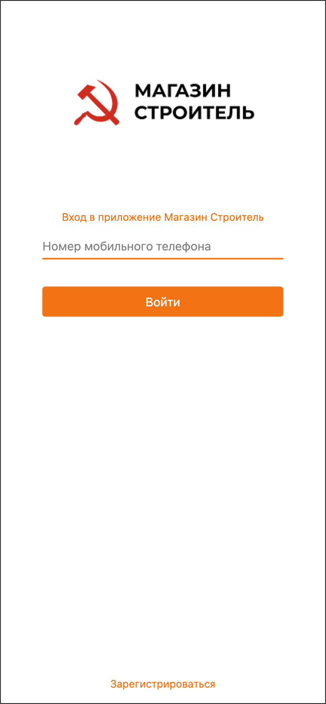
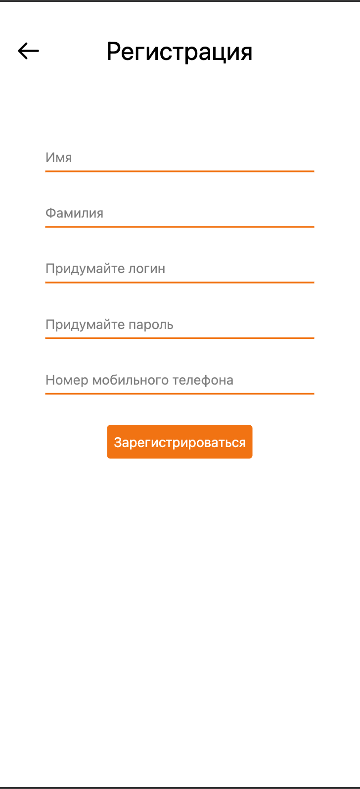
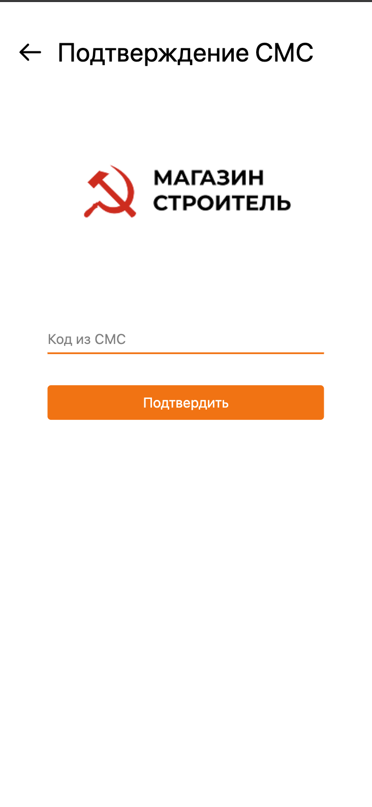
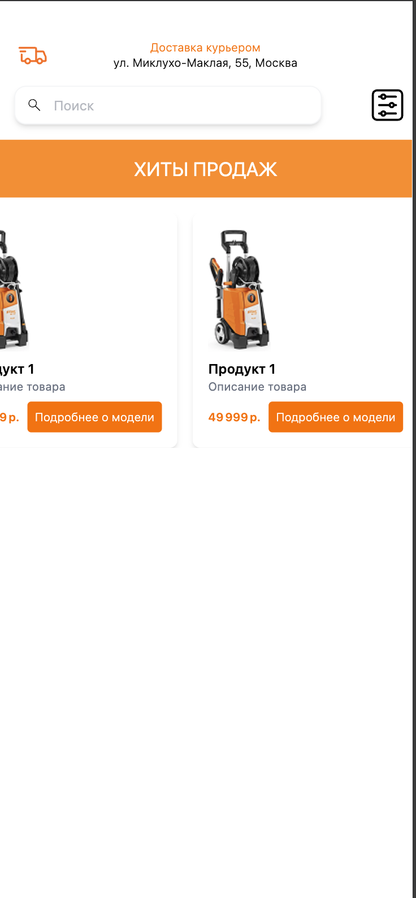

# Магазин Строитель

Репозиторий содержит веб-приложение для магазина «Строитель», реализованное с помощью HTML, CSS (Tailwind) и JavaScript.

## 📋 Содержание

* [Описание проекта](#-описание-проекта)
* [Технологии](#-технологии)
* [Установка и запуск](#-установка-и-запуск)
* [Структура проекта](#-структура-проекта)
* [Использование](#-использование)
* [Скриншоты](#-скриншоты)
* [Лицензия](#-лицензия)
* [Контакты](#-контакты)

## 🎯 Описание проекта

Приложение «Магазин Строитель» позволяет пользователям:

* Войти по номеру телефона.
* Зарегистрироваться, указав имя, фамилию, логин, пароль и номер.
* Перейти в главное меню после успешной верификации.

Цель проекта — демонстрация навыков работы с чистым HTML/CSS/JS и утилитой Iconify для иконок.

## 🛠 Технологии

* **HTML5**
* **CSS3** с [Tailwind CSS](https://tailwindcss.com/)
* **JavaScript** (ES6+)
* **Iconify** для иконок
* **Git & GitHub** для контроля версий и CI (GitHub Actions)

## 🚀 Установка и запуск

1. Клонировать репозиторий:

   ```bash
   git clone git@github.com:имя_пользователя/Construction-store.git
   ```
2. Перейти в папку проекта:

   ```bash
   cd Construction-store
   ```
3. Открыть `index.html` (или запустить локальный сервер, например, с помощью VS Code Live Server).

> **Примечание:** Для полноценной проверки валидации СМС необходимо открыть в браузере страницу `SmsPage.html`.

## 📂 Структура проекта

```
├── index.html           # Главная страница входа
├── RegistrationPage.html# Страница регистрации
├── SmsPage.html         # Страница подтверждения СМС
├── main.js              # Скрипт для главной страницы
├── sms.js               # Скрипт для валидации СМС
├── output.css           # Скомпилированный Tailwind CSS
├── Pictures/            # Папка с изображениями (логотип, favicon)
└── README.md            # Документация проекта
```

## 🎬 Использование

1. Откройте `index.html` и введите номер телефона.
2. Нажмите **Войти** для перехода на страницу регистрации.
3. Заполните форму регистрации и нажмите **Зарегистрироваться**.
4. Введите код из СМС (для теста код `15` покажет ошибку, любой другой — перенаправит в `Menu.html`).

## 📸 Скриншоты

<div align="center">
  
  
  <br><br>
  
  
</div>


## 📄 Лицензия

Проект выпущен под лицензией MIT. Подробнее — см. [LICENSE](LICENSE).

## ✉️ Контакты

* GitHub: [imka07](https://github.com/imka07)
* Email: `imran.shokuev@gmail.com`
